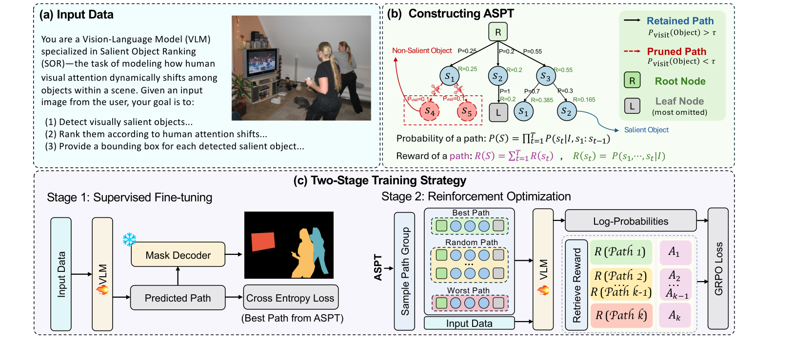

<div align="center">
  <h1>[ICML'26] ProbSOR: Probabilistic Salient Object Ranking</h1>

  <h4>
    <a href="#"></a>
    <a href="#"></a>
    <a href="#"></a>
    <a href="#"></a>
  </h4>

</div>

This repository will host **Probabilistic Salient Object Ranking (ProbSOR)**, a framework for modeling human attention shifts as a probabilistic distribution over multiple plausible salient-object orders.

> Paper: *Probabilistic Salient Object Ranking*  
> Authors: Rongjin Guo, Huankang Guan, Rynson W.H. Lau  
> Venue: ICML 2026

## Paper Overview

Salient Object Ranking (SOR) studies not only **which objects** attract human attention, but also **in what order** they are attended. Existing SOR methods usually predict one deterministic ranking sequence, treating a single object order as the only correct answer. This is often too restrictive: human fixation trajectories are naturally diverse, and several different attention paths may all be plausible for the same image.

ProbSOR reformulates SOR as a probabilistic problem. Instead of learning a single ground-truth order, it represents attention shifts with an **Attention-Shift Probability Tree (ASPT)**, where each root-to-leaf path is a possible attention trajectory and each edge stores a conditional transition probability. The model learns to generate salient-object sequences that match this distribution, and evaluation is performed with probability-aware metrics that reward plausible paths rather than only exact deterministic matches.

## Method



The framework has three main parts:

1. **Input data**: a VLM receives an image and a structured SOR prompt, then predicts ranked salient objects with bounding boxes.
2. **ASPT construction**: human fixation trajectories are converted into an Attention-Shift Probability Tree. Low-visitation nodes are pruned, and each valid path receives a probability and reward.
3. **Two-stage training**: Stage 1 performs supervised fine-tuning on the highest-reward path. Stage 2 samples groups of paths from ASPT and applies GRPO so that high-reward, human-plausible attention paths receive higher likelihood.

## TODO List

- [ ] Release ProbSOR-Bench and preprocessing scripts.
- [ ] Release results of our models.
- [ ] Release code and training/inference instructions.
- [ ] Release pretrained checkpoints.
- [ ] Add evaluation scripts and benchmark commands.

## Citation

```bibtex
@inproceedings{guo2026probsor,
  title     = {Probabilistic Salient Object Ranking},
  author    = {Guo, Rongjin and Guan, Huankang and Lau, Rynson W.H.},
  booktitle = {Proceedings of the 43rd International Conference on Machine Learning},
  year      = {2026}
}
```
